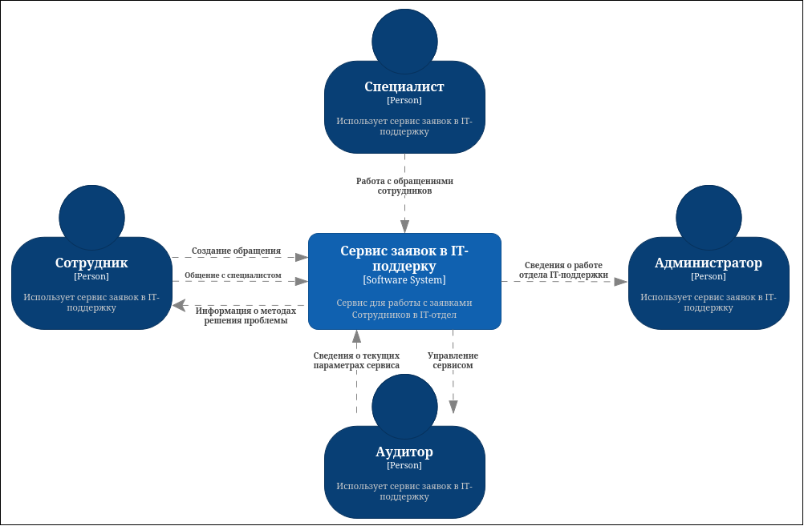
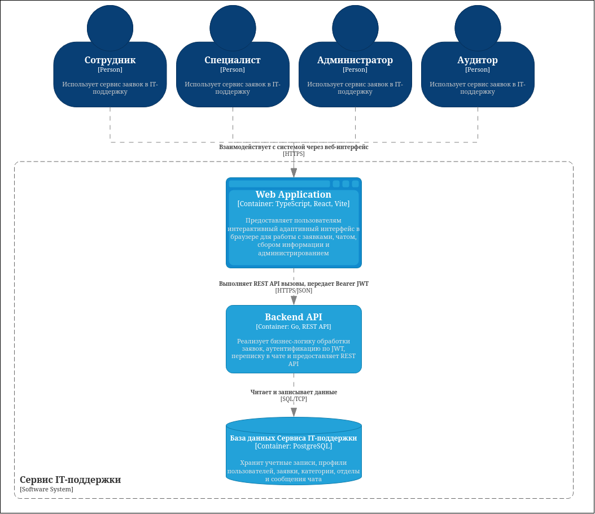

# Архитектура система

# Описание

Этот документ описывает архитектурное решение для выпуска 1.0 (MVP) системы «Сервис заявок в IT-поддержку». В нем представлены C4-диаграммы (уровни Context и Container), иллюстрирующие общую структуру проекта, его основные технические компоненты и взаимодействие с внешними системами и пользователями. Документ предназначен для системных архитекторов, команды разработки, DevOps-инженеров и тестировщиков для понимания технического устройства системы перед ее реализацией и развертыванием.

# Изменения архитектуры системы

| Дата изменения | Версия | Автор | Описание |
|---|---|---|---|
| 27.09.2026 | 1.0 | reflekso | Первая версия архитектуры для MVP |

# C4-диаграммы

## Context-диаграмма

## Container-диаграмма

