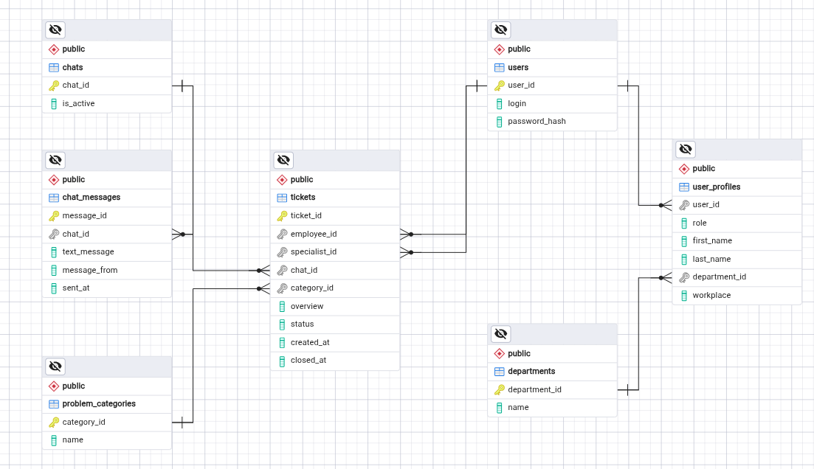

# Спецификация структуры данных

## Описание

Настоящий документ содержит техническую спецификацию структуры данных, включая ER-диаграмму, детальное описание таблиц и схему их маппинга с API. Файл определяет архитектуру хранения и логику передачи информации в системе для обеспечения согласованности разработки.

## Изменения спецификации структуры данных

| Дата изменения | Версия | Автор | Описание |
|---|---|---|---|
| 14.09.2026 | 1.0 | Васильев М.А. | Первая версия требований для MVP |

## ER-диаграмма

## Описание таблиц и полей

### Таблица 1. `users`

| Название атрибута | Тип | Обязательность | Описание |
|---|---|---|---|
| user_id | INT32 | Да | Идентификатор пользователя |
| login | VARCHAR(128) | Да | Логин пользователя |
| password_hash | VARCHAR(255) | Да | Хэш пароля пользователя |

---

### Таблица 2. `user_profiles`

| Название атрибута | Тип | Обязательность | Описание |
|---|---|---|---|
| user_id | INT32 | Да | Идентификатор пользователя (связь с `users.user_id`) |
| role | VARCHAR(10) | Да | Роль пользователя в системе |
| first_name | VARCHAR(64) | Да | Имя пользователя |
| last_name | VARCHAR(64) | Да | Фамилия пользователя |
| department_id | INT32 | Да | Идентификатор рабочего отдела пользователя (связь с `departments.department_id`) |
| workplace | VARCHAR(32) | Нет | Рабочее место пользователя (только у сотрудника) |

---

### Таблица 3. `tickets`

| Название атрибута | Тип | Обязательность | Описание |
|---|---|---|---|
| ticket_id | INT64 | Да | Идентификатор заявки |
| employee_id | INT32 | Да | Идентификатор Сотрудника, создавшего заявку (связь с `users.user_id`) |
| specialist_id | INT32 | Нет | Идентификатор Специалиста, принявшего заявку в работу (связь с `users.user_id`). Изначально NULL до момента, пока Специалист не возьмет заявку в работу |
| chat_id | INT64 | Да | Идентификатор переписки Сотрудника и Специалиста по заявке (связь с `chats.chat_id`) |
| category_id | INT32 | Да | Идентификатор категории проблемы у Сотрудника (связь с `categories_problem.category_id`) |
| overview | TEXT | Да | Описание проблемы Сотрудником |
| status | VARCHAR(40) | Да | Статус заявки (ENUM «Создана», «В работе», «Закрыта специалистом», «Отправлена на доработку», «Закрыта») |
| created_at | TIMESTAMPZ | Да | Дата и время создания заявки |
| closed_at | TIMESTAMPZ | Нет | Дата и время закрытия заявки (заявка перешла в статус «Закрыта») |

---

### Таблица 4. `departments`

| Название атрибута | Тип | Обязательность | Описание |
|---|---|---|---|
| department_id | INT32 | Да | Идентификатор рабочего отдела пользователя |
| name | VARCHAR(128) | Да | Название рабочего отдела |

---

### Таблица 5. `problem_categories`

| Название атрибута | Тип | Обязательность | Описание |
|---|---|---|---|
| category_id | INT32 | Да | Идентификатор категории проблемы у Сотрудника |
| name | VARCHAR(128) | Да | Название категории проблемы |

---

### Таблица 6. `chats`

| Название атрибута | Тип | Обязательность | Описание |
|---|---|---|---|
| chat_id | INT64 | Да | Идентификатор переписки Сотрудника и Специалиста по заявке |
| is_active | BOOLEAN | Да | Статус чата: активен или закрыт |

---

### Таблица 7. `chat_messages`

| Название атрибута | Тип | Обязательность | Описание |
|---|---|---|---|
| message_id | INT64 | Да | Идентификатор сообщения |
| chat_id | INT64 | Да | Идентификатор переписки Сотрудника и Специалиста по заявке (связь с `chats.chat_id`) |
| text_message | TEXT | Да | Текст сообщения, отправленного Сотрудником или Специалистом |
| message_from | VARCHAR(10) | Да | Отправитель сообщения (ENUM «Сотрудник», «Специалист») |
| sent_at | TIMESTAMPZ | Да | Дата и время отправки сообщения |

