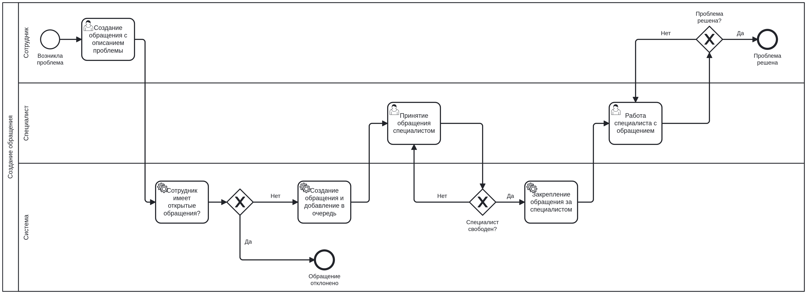

# Project Brief

# Название проекта: 

Сервис заявок в IT-поддержку

# Проблема:

В компании N работает 200 сотрудников. В течение рабочего дня у них может перестать работать программа или оборудование. Для получения помощи нужно обратиться к отделу IT-поддержки одним из способов: идти к ним в офис, звонить по телефону, писать в мессенджерах. Сотрудники не знают статус своей заявки, поэтому повторно обращаются в отдел. Из-за этого их обращения дублируются или теряются.

Руководитель IT-поддержки не может качественно собирать отчетность о работе отдела. Невозможно точно узнать сколько обращений обрабатывается, какие наиболее частые проблемы возникают у сотрудников, как долго им помогают.

# Цель:

Разработать единый сервис для IT-поддержки с возможностью создания, обработки, отслеживания обращений.

# Бизнес-цели: 

1. Полностью исключить потерянные заявки

2. Уменьшить время обработки заявок на 70%

3. Организовать ведение отчетности по заявкам в IT-поддержку

# Роли пользователей:

| **Роль** | **Конкретные лица** | **Потребности** |
|---|---|---| 
|Аудитор|Руководитель отдела IT-поддержки|Сбор отчетности по работе отдела|
|Администратор|Назначенный сотрудник отдела IT-поддержки|Управление категориями заявок сотрудников, названиями рабочих отделов, создание аккаунтов сотрудников и специалистов для системы|
|Специалист|Сотрудники отдела IT-поддержки|Возможность оказать помощь сотрудникам|
|Сотрудник|Все сотрудники компании, кроме отдела IT-поддержки|Получение помощи от специалиста|

# Бизнес-правила:

BR1. Специалист одновременно может помогать только одному сотруднику.

BR2. Сотрудник не может обращаться за помощью, когда ему уже помогают.

BR3. Сотрудник видит только созданные им заявки.

BR4. Сотрудник и Специалист могут общаться только если заявка в статусе "В работе".

BR5. Если Сотрудник отправил заявку на доработку, то Специалист, закрепленный за этой заявкой, не может принимать другие заявки кроме этой.

BR6. Если у Специалиста есть заявка со статусом "В работе", то он не может взять любую другую заявку.

BR7.  Если у Специалиста есть заявка со статусом "Отправлена на доработку", то он может взять в работу только её.

# Ограничения:

1. Система - веб-сервис

2. Аккаунты пользователя создает и настраивает администратор.

# Основные функции:

|**ID**|**Функция**|**Для кого**|**Описание**|
|---|---|---|---|
|F1|Создать обращение|Сотрудник|Создание обращения с выбором категории проблемы и ее описанием|
|F2|Принять обращение|Специалист|Принятие обращения сотрудника в обработку|
|F3|Ответить на обращение|Специалист|Ответ сотруднику на его обращение с решением проблемы|
|F4|Формирование отчетности|Аудитор|Получение сведений о работе отдела IT-поддержки (статистика по заявкам, просмотр общего списка заявок)|
|F5|Настроить сервис|Администратор|Регистрация аккаунтов пользователей (сотрудников и специалистов), настройка категорий проблем, заполнение названий рабочих отделов|

# Бизнес риски и меры:

|**Риск**|**Вероятность**|**Урон**|**Мера**|
|---|---|---|---|
|Неприятие пользователями|Высокая|Высокий|Не оказывать помощь сотрудникам, которые не пользуются системой|
|Неточные данные|Средняя|Высокий|Обязательные поля для заполнения информации о проблеме|
|Недостижение метрик|Средняя|Средний|Выделение критичных категорий проблем|

# BPMN-диаграмма главного бизнес-процесса: 

# Глоссарий:

Заявка (обращение) – запрос к отделу IT-поддержки с возникшей проблемой.

Открытая заявка(обращение) – заявка, в которой проблема еще не решена до конца.